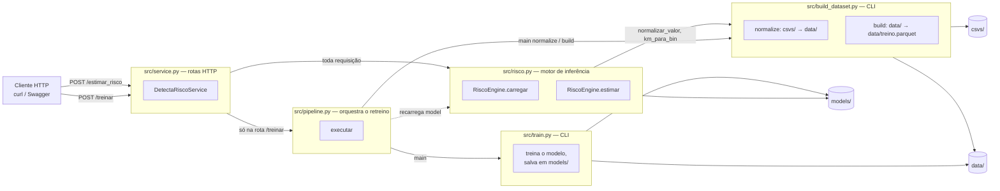

# Arquitetura do DetectaRisco

Guia do que cada arquivo faz.

## Visão geral em uma frase

Um cliente HTTP bate em `POST /estimar_risco` ou `POST /treinar`;
`service.py` só roteia — quem responde de verdade é `risco.py` (inferência)
ou `pipeline.py` (que por sua vez aciona `build_dataset.py` e `train.py`).

## Fluxograma

Leitura do desenho: as setas sólidas são chamada direta de função/import. A
seta pontilhada é o único "efeito colateral" fora do fluxo normal — depois
que `/treinar` termina, `service.py` manda `RiscoEngine` recarregar os
artefatos novos, sem reiniciar o processo.

## `src/service.py` — rotas HTTP

O único arquivo que sabe que existe BentoML. Não tem lógica de negócio —
só recebe a requisição, chama o módulo certo e devolve o dicionário.

- `DetectaRiscoService.__init__` — cria um `RiscoEngine` (carrega o modelo
  na memória) e um `threading.Lock` (evita dois treinos rodando ao mesmo
  tempo).
- `estimar_risco(trecho)` → chama direto `self.engine.estimar(trecho)`.
- `treinar(config)` → confere se tem CSV (`csvs_disponiveis()`), tenta
  pegar o lock, chama `executar_treino(config)` e depois
  `self.engine.carregar()` pra trocar o modelo em uso sem reiniciar o
  servidor.

## `src/risco.py` — motor de inferência

Responde "qual o risco desse trecho-período?". É o que `/estimar_risco`
usa.

- `Trecho` — o schema do payload (`uf`, `br`, `km`, `dia_semana`,
  `fase_dia`), validado automaticamente pelo BentoML via Pydantic.
- `RiscoEngine.carregar()` — lê `models/model.pkl`, `metadata.json`,
  `perfis.parquet` e `jurisdicao.parquet` pra memória. Chamado no boot e
  de novo depois de todo retreino.
- `RiscoEngine.estimar(trecho)` — normaliza o payload (mesmas regras do
  treino: `normalizar_valor` e `km_para_bin`, importadas de
  `build_dataset.py`), procura a linha correspondente em `perfis`. Se não
  achar, devolve `INSUFICIENTE` (abstenção, RE-6) sem chamar o modelo. Se
  achar, roda `predict_proba` e monta a resposta com `fatores` (RE-7) e
  `jurisdicao` (RE-1).
- `RiscoEngine._jurisdicao_do_trecho()` — helper interno, busca
  `uop`/`delegacia`/`regional`/`municipio` em `jurisdicao.parquet`.

## `src/pipeline.py` — orquestra o retreino

Não treina nada sozinho. Só decide *a ordem* de chamar os outros dois
scripts. Existe pra dar suporte à rota `/treinar`.

- `TreinoConfig` — os parâmetros que a rota aceita (`km_bin`, `limiar`,
  `anos_historico`, `ano_alvo`, etc.), com os mesmos defaults do PLANO.md.
- `csvs_disponiveis()` — checa se tem CSV da PRF em `csvs/` antes de
  começar (senão o erro só apareceria depois de minutos de processamento).
- `executar(config)` — chama `build_dataset.main(["normalize"])` (só se
  `data/` ainda não tiver os parquets do(s) ano(s) pedidos),
  `build_dataset.main(["build", ...])` e por fim `train.main([...])`.

## `src/build_dataset.py` — CLI de dados

O mais longo do projeto porque é o que lida com os dados brutos e sujos da
PRF. Dois estágios usados em produção (tem um terceiro,
`trecho-report`, que só serviu pra decidir o tamanho do trecho e não entra
no fluxo do serviço):

**`normalize`** (`estagio_normalize` → `normalizar_ano` → `ler_ano`) — lê
um CSV bruto por ano (`;`, latin-1, decimal vírgula), descarta linhas sem
`br`/`km`/`uop`, e separa em: uma linha por ocorrência
(`data/ocorrencias_<ano>.parquet`) e três tabelas longas
(`causas_<ano>.parquet`, `tipos_<ano>.parquet`, `veiculos_<ano>.parquet`) —
porque um acidente tem várias causas/tipos/veículos.

**`build`** (`estagio_build`) — pega o histórico 2020-2024, filtra só
trechos com acidentes suficientes (RE-6), monta o perfil de cada trecho
(`perfil_do_trecho` — chama `shares_por_trecho` várias vezes pra
tipo_pista, clima, causas, tipos de acidente, veículos), monta a
jurisdição de cada trecho (moda de `uop`/`delegacia`/`regional`), rotula
com o que aconteceu no ano-alvo (`rotular`) e salva
`data/treino.parquet` + `data/jurisdicao.parquet`.

Duas funções exportadas e reusadas por `risco.py` (ver seção acima, elas
precisam ser *idênticas* nos dois lados ou a busca do serviço quebra):

- `normalizar_valor(valor)` — minúsculas, sem acento, sem espaço nas
  pontas. Usada tanto pra montar a chave do trecho-período quanto pra
  normalizar o payload da API.
- `km_para_bin(km, tamanho)` — arredonda um km pra baixo, pro múltiplo de
  `tamanho` mais próximo (42.5, 10 → 40).

## `src/train.py` — treina o modelo

O único arquivo que de fato faz machine learning.

- `carregar()` — lê `data/treino.parquet`.
- `dividir(df, test_size, seed)` — split **por trecho** (não por linha,
  ver o docstring da função — cada trecho tem 28 linhas que compartilham
  as features `tr_*`, dividir por linha vazaria informação).
- `baseline_historico(df)` — a prática de hoje (olhar onde já houve
  acidente grave), usada como régua de comparação obrigatória.
- `montar_modelo(colunas, seed)` — monta o `Pipeline` do scikit-learn
  (`OrdinalEncoder` pras categóricas + `HistGradientBoostingClassifier`).
- `avaliar(...)` / `avaliar_prioridade(...)` — métricas de classificação e
  a métrica que importa pra entrega (priorização sob orçamento fixo).
- `importancias(...)` — importância por permutação (RE-7).
- `main(argv)` — chama tudo isso em sequência e salva `models/model.pkl`,
  `models/metadata.json`, `models/perfis.parquet` (features sem o rótulo)
  e `models/jurisdicao.parquet` (cópia do `data/jurisdicao.parquet`).

## Infraestrutura

- **`pyproject.toml` / `uv.lock`** — dependências gerenciadas por `uv`
  (`bentoml`, `scikit-learn`, `pandas`, `pyarrow`, `joblib`, `numpy`).
- **`Dockerfile`** — imagem baseada em `uv`, copia `src/` e `models/`,
  sobe com `bentoml serve src.service:DetectaRiscoService`.
- **`docker-compose.yml`** — builda a imagem e monta `models/`, `data/` e
  `csvs/` como volumes. Os volumes existem por causa da rota `/treinar`:
  sem eles o container não enxergaria os CSVs no host nem persistiria um
  modelo retreinado de volta pro host.

## Pastas de dados (não são código)

- `csvs/` — dados brutos da PRF, baixados manualmente, não versionados
  (1,2 GB).
- `data/` — parquets intermediários gerados por `build_dataset.py`, não
  versionados.
- `models/` — os únicos artefatos de dados que **são** versionados:
  `model.pkl`, `metadata.json`, `perfis.parquet`, `jurisdicao.parquet`.
  É o que o serviço precisa pra responder sem depender de `csvs/`/`data/`.
